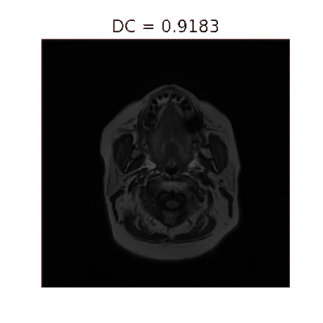
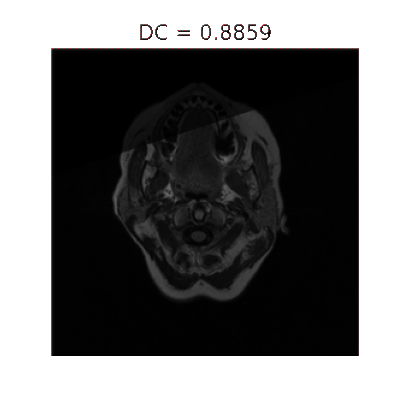
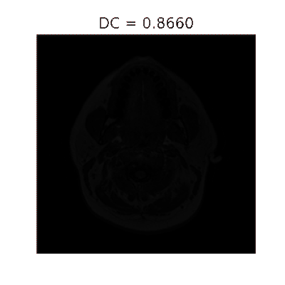
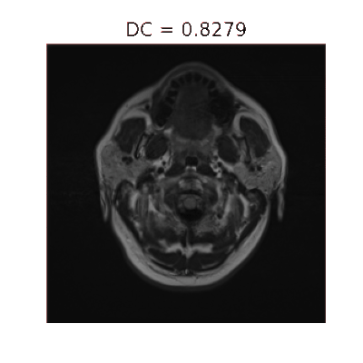
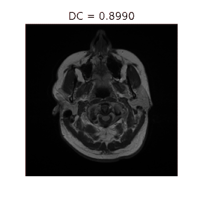

# MRI Segmentation
Implementation of the U-Net model for brain abnormalities segmentation detailed in **[Association of genomic subtypes of lower-grade gliomas with shape features automatically extracted by a deep learning algorithm](https://www.sciencedirect.com/science/article/abs/pii/S0010482519301520?via%3Dihub)**.  For more information of the original source code, check the [MATLAB](https://github.com/MaciejMazurowski/brain-segmentation) and [PyTorch](https://github.com/mateuszbuda/brain-segmentation-pytorch) code written by the authors.


## Dataset

The dataset used for training this model is the [Brain MRI segmentation dataset](https://www.kaggle.com/mateuszbuda/lgg-mri-segmentation), which is available on Kaggle. It contains data from 110 patients. Data consists of MRI slices of size 256x256x3 and the respective binary mask 256x256. The minimum and the maximum number of slices for a patient are 20 and 88, respectively.


## Training

The network was trained using 105 patients, the remaining 5 were used for validation. Data augmentation consisted in rotations between -20 and 20 degrees, horizontal and vertical flips. The loss was computed using the [Dice coefficient](https://en.wikipedia.org/wiki/Sørensen–Dice_coefficient). The model was trained during 85 epochs on GPU. The weights with the best validation loss are retrieved for prediction in validation. 


## Results

The average validation accuracy is appoximately 88%. Green segmentations in the slices below represents the ground truth, red segmentations denote the prediction by the model.

<p align="center" width="100%">
     
     
     
</p>

<p align="center" width="66%">
     
     
</p>


## Installation

To install the dependencies, run the following command:

```bash
pip install -r requirements.txt
```

If using Conda, you can also create an environment with the requirements:

```bash
conda env create -f environment.yml
```

By default the environment name is `mri-segmentation`. To activate it run:

```bash
conda activate mri-segmentation
```


## Usage

The model can be trained using the following command:

```bash
python -m mri_segmentation
```

To visualize and save predictions, check the file `visualize_prediction.ipynb` in the `notebooks/` folder.